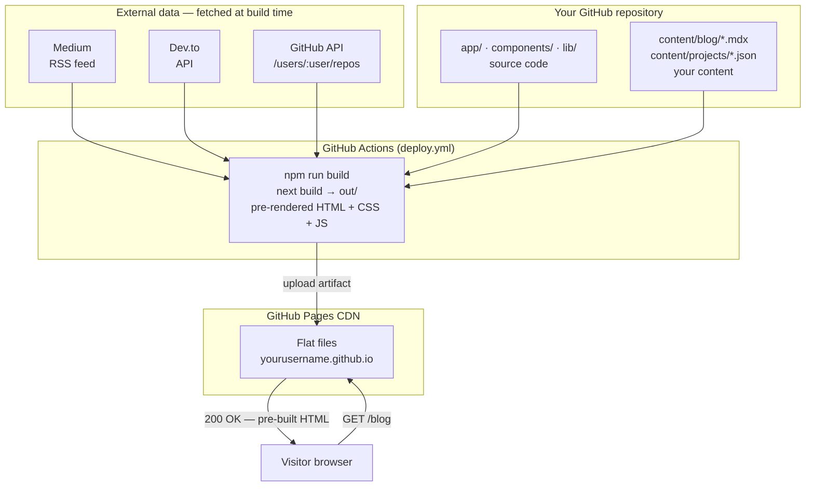
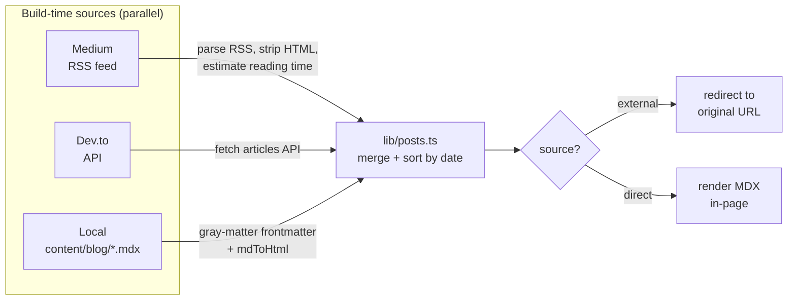
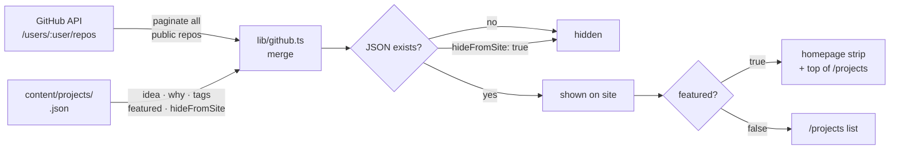
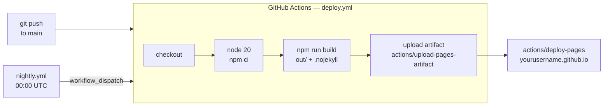

# TheProdSDE — Developer Portfolio & Blog

> A fast, zero-cost personal site that lives on GitHub Pages and auto-deploys on every push.

[](https://github.com/TheProdSDE/theprodsde.github.io/actions/workflows/deploy.yml)
[](https://github.com/TheProdSDE/theprodsde.github.io/actions/workflows/ci.yml)
[](LICENSE)


[](https://github.com/TheProdSDE/theprodsde.github.io/commits/main)

Live at **[theprodsde.github.io](https://theprodsde.github.io)**

---

## What it is

A statically exported Next.js site that combines three things into one place:

- **Blog** — pulls posts from Medium, Dev.to, and local MDX files and surfaces them in a unified feed
- **Projects** — syncs your public GitHub repos automatically; enrich any repo with a local JSON file to add context, tags, and featured status
- **Papers / Publications** — lightweight card listing for research, talks, or articles

No database. No server. No hosting bill. Deploys to GitHub Pages via a one-file GitHub Actions workflow on every push to `main`.

---

## Tech stack

| Layer | Choice |
|---|---|
| Framework | Next.js 16 (App Router, static export) |
| Styling | Tailwind CSS 3 + `@tailwindcss/typography` |
| Content | MDX via `@next/mdx` + `gray-matter` |
| Blog sources | Medium RSS · Dev.to API · local `.mdx` files |
| Projects | GitHub REST API (`/users/:user/repos`) |
| Fonts | Syne (display) · Inter (body) · JetBrains Mono |
| Testing | Vitest |
| CI/CD | GitHub Actions → GitHub Pages |

---

## Project structure

```
.
├── app/                    # Next.js App Router pages
│   ├── page.tsx            # Homepage — hero, featured projects, latest posts
│   ├── blog/
│   │   ├── page.tsx        # Blog listing with tag filter
│   │   └── [slug]/page.tsx # Blog post renderer (redirects external posts)
│   └── projects/
│       ├── page.tsx        # Projects listing
│       └── [slug]/page.tsx # Project detail with GitHub README
├── components/             # Reusable UI components
│   ├── BlogCard.tsx
│   ├── BlogFilter.tsx
│   ├── Nav.tsx
│   ├── Footer.tsx
│   ├── ProjectCard.tsx
│   └── SocialLinks.tsx
├── content/
│   ├── blog/               # Local .md / .mdx posts
│   ├── projects/           # Per-repo JSON metadata files
│   └── papers/             # Publication/talk cards
├── lib/
│   ├── posts.ts            # Aggregates all blog sources
│   ├── github.ts           # GitHub API + local meta merge
│   ├── medium.ts           # Medium RSS parser
│   ├── devto.ts            # Dev.to API client
│   └── text.ts             # Reading time, HTML strip, truncate
├── types/index.ts          # Shared TypeScript types
├── .github/workflows/
│   ├── deploy.yml          # Build + deploy to GitHub Pages
│   └── nightly.yml         # Nightly rebuild to keep feeds fresh
└── CONTENT_GUIDE.md        # How to add posts, projects, and papers
```

---

## How it works

### System architecture



### Request / response cycle

There is no server. All data fetching happens at build time; every visitor receives a pre-built HTML file from the CDN.

```mermaid
sequenceDiagram
    participant Dev  as Developer
    participant GH   as GitHub repo
    participant CI   as GitHub Actions
    participant Ext  as External APIs
    participant CDN  as GitHub Pages CDN
    participant User as Visitor browser

    rect rgb(20, 30, 50)
        Note over Dev,CDN: Build time — once per push to main

        Dev->>GH: git push main
        GH->>CI: trigger deploy.yml
        par fetch content
            CI->>Ext: Medium RSS feed
            CI->>Ext: Dev.to articles API
            CI->>Ext: GitHub repos API
        end
        Ext-->>CI: posts + projects + repo data
        CI->>CI: next build — pre-render every page to out/
        CI->>CDN: upload out/ as Pages artifact
        CDN-->>Dev: live at yourusername.github.io
    end

    rect rgb(20, 40, 30)
        Note over User,CDN: Request time — every visitor, no server involved

        User->>CDN: GET /
        CDN-->>User: 200 OK — index.html (~50ms TTFB)
        User->>CDN: GET /blog/my-post
        CDN-->>User: 200 OK — pre-built post HTML
        Note over User: No API calls at runtime.<br/>No database. No cold starts.<br/>Just flat files on a CDN.
    end
```



### Blog aggregation



### Project sync



### Deploy pipeline



---

## Running locally

**Prerequisites:** Node.js 20+, npm

```bash
# Clone
git clone https://github.com/TheProdSDE/theprodsde.github.io.git
cd theprodsde.github.io

# Install
npm install

# (Optional) set a GitHub PAT to avoid API rate limits during dev
export GH_PAT=ghp_your_token_here

# Start dev server
npm run dev
```

Open [http://localhost:3000](http://localhost:3000).

### Other commands

```bash
npm run build    # Static export → out/
npm run lint     # ESLint
npm run test     # Vitest unit tests
```

---

## Adding content

See [CONTENT_GUIDE.md](CONTENT_GUIDE.md) for the full reference. Quick summary:

**Add a blog post** — create `content/blog/my-post.mdx`:

```md
---
title: "My Post Title"
date: "2026-09-01"
tags: ["engineering", "systems"]
excerpt: "One sentence shown on the listing card."
---

Your Markdown content here.
```

**Register a GitHub project** — create `content/projects/my-repo.json` (filename must match the exact repo name):

```json
{
  "idea": "What it does in one line.",
  "why": "Why you built it.",
  "tags": ["typescript", "cli"],
  "featured": true,
  "hideFromSite": false
}
```

**Add a paper / talk** — create `content/papers/my-talk.md`:

```md
---
title: "Talk Title"
date: "2026-01-15"
venue: "Conference Name"
url: "https://link-to-slides-or-paper.com"
abstract: "Short description shown on the card."
tags: ["distributed systems"]
---
```

---

## Deployment

Push to `main` — the [deploy workflow](.github/workflows/deploy.yml) takes it from there (see the pipeline diagram above). A [nightly workflow](.github/workflows/nightly.yml) rebuilds at 00:00 UTC to pull in fresh Medium and Dev.to posts without any manual push.

### Required GitHub settings

1. Go to **Settings → Pages** and set source to **GitHub Actions**
2. (Optional but recommended) Add a repository secret named `GH_PAT` with a fine-grained Personal Access Token scoped to `public_repositories` read-only — this raises the GitHub API rate limit from 60 to 500 requests/hour during builds

---

## Customising for your own use

1. **Fork** this repo and rename it to `<your-github-username>.github.io`
2. In `lib/github.ts`, change `GITHUB_USER` to your GitHub username
3. In `lib/medium.ts`, update `FEED_URL` to your Medium RSS feed
4. In `lib/devto.ts`, update `USERNAME` to your Dev.to handle
5. Update the hero copy, quote, and social links in `app/page.tsx` and `components/SocialLinks.tsx`
6. Add your `GH_PAT` secret in repo Settings → Secrets → Actions
7. Push — your site is live at `https://<your-username>.github.io`

---

## Design system

The site uses a single-accent dark theme:

| Token | Value | Use |
|---|---|---|
| `ink` | `#08090D` | Page background |
| `surface` | `#111318` | Card backgrounds |
| `border` | `#1E2130` | Dividers, card outlines |
| `lime` | `#C8F04B` | Primary accent, links, badges |
| `text-primary` | `#F0F2F7` | Headings, important text |
| `text-muted` | `#7A8099` | Body text, metadata |

Fonts: **Syne** for headings, **Inter** for body, **JetBrains Mono** for code and metadata.

---

## License

Copyright 2026 TheProdSDE (Karan Gehlod)

Licensed under the **Apache License, Version 2.0** — see [LICENSE](LICENSE) for the full text.

You may use, copy, modify, distribute, and fork this project freely under the terms of the license. Attribution is required; the license and copyright notice must be retained in any derivative work.
