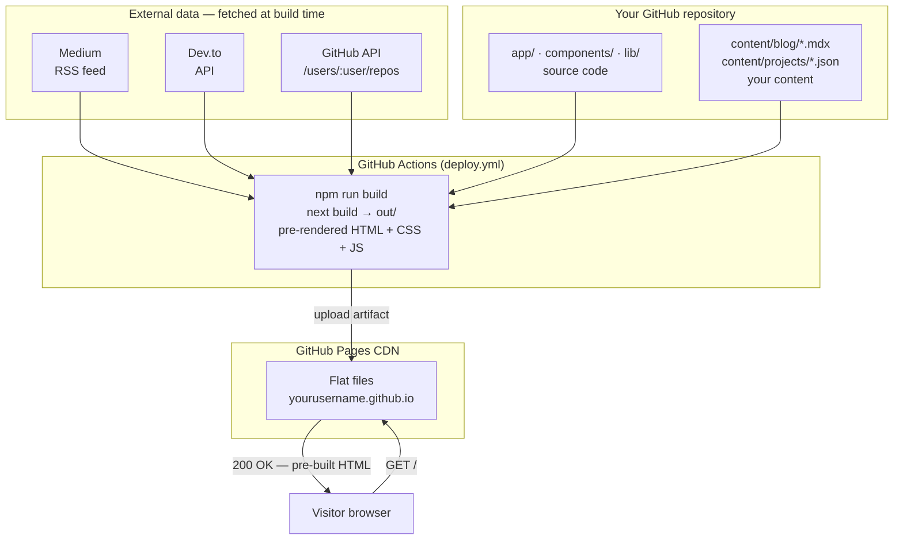

## The problem with most portfolio advice

Every guide tells you the same thing: pick a template, swap the name, deploy to Vercel. You end up with a site that looks like ten thousand other portfolios because it *is* ten thousand other portfolios.

Interviewers see them constantly. They glance, they tab away.

What actually works is a portfolio that tells a story — your projects explained in your voice, your writing showing how you think, your real GitHub work front and centre. The kind of thing that makes someone say "tell me more about this" rather than "next".

The good news: with AI tools doing the heavy lifting on scaffolding and design, you can build that kind of site in an afternoon. For free. Forever.

---

## What we're building

- A Next.js site deployed on GitHub Pages at `https://yourusername.github.io`
- Zero hosting cost, zero ongoing maintenance
- Auto-deploys when you push to `main`
- Blog that aggregates posts from Medium, Dev.to, and local Markdown files
- Projects pulled directly from your GitHub — no copy-pasting needed
- A design you can actually be proud of

Here's the architecture in one sentence: **a static Next.js export that pulls your content at build time and serves it as flat HTML files from GitHub Pages.**

Here's what that looks like end-to-end:



The key insight: **there is no server at runtime**. All the API calls to Medium, Dev.to, and GitHub happen during the build. By the time a visitor loads your site, every page is already a flat HTML file sitting on a CDN.

```mermaid
sequenceDiagram
    participant Dev  as You (developer)
    participant GH   as GitHub repo
    participant CI   as GitHub Actions
    participant Ext  as External APIs
    participant CDN  as GitHub Pages CDN
    participant User as Visitor browser

    rect rgb(20, 30, 50)
        Note over Dev,CDN: Build time — runs once when you push to main

        Dev->>GH: git push main
        GH->>CI: trigger deploy.yml
        par fetch your content
            CI->>Ext: Medium RSS feed
            CI->>Ext: Dev.to articles API
            CI->>Ext: GitHub repos API
        end
        Ext-->>CI: posts + projects + repo data
        CI->>CI: next build — pre-render every page to out/
        CI->>CDN: upload out/ as Pages artifact
        CDN-->>Dev: live at yourusername.github.io
    end

    rect rgb(20, 40, 30)
        Note over User,CDN: Request time — every visitor, no server involved

        User->>CDN: GET /
        CDN-->>User: 200 OK — index.html (~50ms TTFB)
        User->>CDN: GET /projects/my-repo
        CDN-->>User: 200 OK — pre-built project HTML
        Note over User: No API calls at runtime.<br/>No database. No cold starts.<br/>Just flat files on a CDN.
    end
```



This is why the Lighthouse score is high and why you pay nothing. No compute, no memory, no egress — just storage and bandwidth, which GitHub Pages provides free.

---

## Step 1: Fork the template

This entire site is open-source. Fork it:

1. Go to [github.com/TheProdSDE/theprodsde.github.io](https://github.com/TheProdSDE/theprodsde.github.io)
2. Click **Fork**
3. Name the new repo exactly `<your-github-username>.github.io` — this is what makes GitHub Pages serve it at your root domain

You now own the repo. Nothing is connected to the original except git history.

---

## Step 2: Run it locally with AI assistance

Clone your fork:

```bash
git clone https://github.com/yourusername/yourusername.github.io.git
cd yourusername.github.io
npm install
npm run dev
```

Open [http://localhost:3000](http://localhost:3000). You'll see the original site.

Now open Claude Code (or your AI tool of choice) in the project directory:

```bash
claude
```

Tell it what you want:

> "This is my portfolio. Update the hero section in app/page.tsx with my name, a one-line bio about being a backend engineer with 3 years of Go experience, and a quote I like. Keep the design and layout exactly the same."

The AI reads the file, makes the change, done. No hunting through JSX for the right `<h1>`. No guessing which prop controls what.

This is the core workflow for the whole build: **describe the outcome you want in plain English, let the AI make the surgical edit.**

---

## Step 3: Wire up your content sources

Open `lib/github.ts` and change one line:

```typescript
const GITHUB_USER = "yourusername";  // ← your GitHub username
```

Open `lib/medium.ts` and update the feed URL if you write on Medium:

```typescript
const FEED_URL = "https://medium.com/feed/@yourusername";
```

Open `lib/devto.ts` for Dev.to:

```typescript
const USERNAME = "yourusername";
```

That's it. Your projects and posts will start pulling in at the next build.

---

## Step 4: Register your projects

The site doesn't show GitHub repos by default — you opt them in. This prevents half-finished experiments and forks from cluttering your portfolio.

For each project you want to show, create a JSON file at `content/projects/your-repo-name.json`:

```json
{
  "idea": "A CLI tool that diffs Kubernetes YAML manifests across environments.",
  "why": "I kept running into drift between staging and prod configs that only showed up at 2am on-call. Wrote this to catch it in CI instead.",
  "tags": ["go", "kubernetes", "devops", "cli"],
  "featured": true,
  "hideFromSite": false
}
```

The `why` field is the most important one. It's what an interviewer reads and thinks "this person solves real problems". Let AI help you write it:

> "Help me write the 'why' for a JSON portfolio entry. The project is a CLI tool I built to diff Kubernetes YAML manifests. The real reason I built it was to catch config drift between environments before it caused incidents. Keep it to 2-3 sentences, first-person, honest and direct."

Set `"featured": true` on your two or three best projects — they'll appear on the homepage and at the top of the Projects page.

---

## Step 5: Write your first blog post

Create `content/blog/my-first-post.mdx`:

```md
---
title: "What I learned maintaining a 200k req/min Go service"
date: "2026-09-04"
tags: ["go", "production", "reliability"]
excerpt: "The three things that actually mattered when everything else was on fire."
---

## Context

...
```

Use AI to get unstuck when the blank page is intimidating:

> "I want to write a blog post about what I learned on-call maintaining a high-traffic Go service. Give me an outline — 4-5 sections, each with a concrete lesson, no generic advice. Base it on this experience: [paste your notes or bullet points]."

Take the outline, fill in your own words, push. Done.

---

## Step 6: Enable GitHub Pages

1. Go to your repo → **Settings** → **Pages**
2. Under **Build and deployment**, set Source to **GitHub Actions**
3. Save

The deploy workflow (`.github/workflows/deploy.yml`) is already in the repo. It runs on every push to `main`, builds the static site, and deploys it.

Push any change:

```bash
git add .
git commit -m "feat: personalise site with my details"
git push
```

Go to **Actions** in your repo. You'll see the workflow running. In 2–3 minutes, your site is live at `https://yourusername.github.io`.

---

## Step 7: (Optional) Set up a GitHub PAT for higher API limits

The GitHub API allows 60 unauthenticated requests per hour. During a build, the site fetches your repos — if you have many, you might hit the limit.

A Personal Access Token raises this to 500/hour.

1. Go to GitHub → Settings → Developer settings → Personal access tokens → Fine-grained tokens
2. Create a token with **Contents: Read-only** on all public repos
3. In your repo → Settings → Secrets and variables → Actions → New repository secret
4. Name: `GH_PAT`, Value: your token

The deploy workflow already reads `GH_PAT` from the environment — no other changes needed.

---

## The actual output

When you hand this URL to an interviewer, here's what they see:

- Your hero with your name and what you actually do
- Featured projects with honest context about *why* you built them, not just what they are
- Your writing — real thoughts about real engineering problems
- A link to every public repo, with GitHub star counts and last-updated dates
- A site that loads fast because it's static HTML

That last point matters more than people realise. A slow portfolio is a red flag. This one gets a Lighthouse performance score in the high 90s because there's no JavaScript runtime, no API calls at render time, and no third-party scripts — just prebuilt HTML.

---

## What AI actually helped with

I want to be honest about where AI was useful vs. where it wasn't.

**High value:**
- Scaffolding the initial component structure — telling it "I need a BlogCard component that takes a post object and shows title, date, excerpt, tags, and source badge" saved two hours
- Writing prose for project `why` fields — I knew what I wanted to say; AI helped me say it clearly and concisely
- Debugging CSS issues — "this card's hover state isn't working on mobile, here's the component" got a fix in seconds
- Updating boilerplate in bulk — changing the GitHub username across multiple files, updating metadata, etc.

**Low value / do it yourself:**
- Architecture decisions — I tried asking "what's the best way to aggregate blog posts from multiple sources" and got generic answers. The real answer came from thinking about the constraints (static export, build-time fetch, no server) myself
- Design sensibility — AI can implement a design but it can't tell you what *good* looks like for your brand. That required looking at sites I respect and making deliberate choices
- Content — no AI wrote the actual blog posts or the project `why` fields wholesale. It helped draft and edit; the substance was mine

The pattern: use AI as a fast, tireless implementer. Keep the strategy and voice your own.

---

## Cost breakdown

| Item | Cost |
|---|---|
| Hosting (GitHub Pages) | $0/month |
| Domain (`yourusername.github.io`) | $0 |
| CI/CD (GitHub Actions) | $0 (2000 min/month free) |
| AI tool (Claude Code, free tier) | $0 |
| **Total** | **$0** |

If you want a custom domain (`yourname.dev`), that's ~$12/year from any domain registrar. Point it at GitHub Pages in four DNS records and add it in Settings → Pages. Otherwise, the `.github.io` URL is perfectly professional.

---

## Maintenance

The nightly workflow (`.github/workflows/nightly.yml`) rebuilds the site every night to pull in fresh Medium and Dev.to posts. You don't need to touch anything — push a new article to Medium and it appears on your portfolio the next morning.

For projects: create a new repo on GitHub, push some code, add a `content/projects/your-repo.json` file to your portfolio repo, push, done.

---

## One thing to do before your next interview

If you don't have a portfolio link yet, fork the repo tonight. Spend 30 minutes with AI replacing the placeholder content with yours. Push. You'll have a live URL before you go to sleep.

That URL in an application or at the bottom of your LinkedIn profile does one thing: it shows you ship. Not "I know how to code in theory" — "I built and deployed a real thing that works right now."

That is a meaningful signal to anyone hiring.
